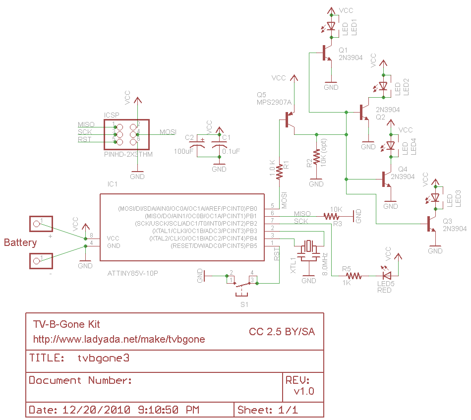

<iframe width="560" height="315" src="https://www.youtube.com/embed/44Ok92cPIOk" title="YouTube video player" frameborder="0" allow="accelerometer; autoplay; clipboard-write; encrypted-media; gyroscope; picture-in-picture" allowfullscreen></iframe>

  

### What is a TV B Gone?
The TV-B-Gone is a universal "remote" created by [Mitch Altman]() that can turn off almost any TV in a ~150 foot range.  This works by blasting a curated list of [infrared light (IR)]() turn-off codes from various TV manufacturers at the target device, until one of them is successful.

You can [buy the original TV-B-Gone](https://www.tvbgone.com/) on their website, or pick up an [awesome DIY Kit from Adafruit]() that also supports the open-source project!

### Why Build One From Scratch?
Since I was poor and had a lot of scrap electronics lying around, I opted to create my own TV-B-Gone - which proved to be a fun but intensive soldering project!

You can follow along with my video and also use the resources on this webpage to build your own, but feel free to take liberty with the layout & form factor!

### Getting Started
To build your own TV-B-Gone, we'll be referencing the schematic below from [Adafruit](), and you'll also need to gather the following components:

| Component | Quantity |
| --- | --- |
| [Infrared LED]() | 4 |
| [ATtiny85]() + [8 Pin DIP Socket]() | 1 |
| [8 MHz Resonator]() | 1 |
| [Perfboard]() | 1 |
| [.1uF Capacitor (non-polar)]() | 1 |
| [100uF Capacitor (polar)]() | 1 |
| [NPN Transistor]() | 4 |
| [PNP Transistor]() | 1 |
| [1K Ohm Resistor]() | 2 |
| [10K Ohm Resistor]() | 1 |
| [Tactile Switch]() | 1 |
| [Battery Holder]() | 1 |
| [LED]() | 1 |

### Design Decisions
##### Power + Layout
Since I wanted to closely replicate the [Adafruit TV-B-Gone Kit]() design, I opted to use the same [x2 AA battery holder](), and trimmed a piece of perfboard to the dimensions of it.  The AA battery design makes it quick and easy to swap out batteries, but you can also easily use a [LiPo battery]() with an adequate [charging circuit]() for a slimmer setup!

##### Infrared LED's
While the Adafruit TV-B-Gone Kit uses wide angle IR LED's, you can easily substitute 4x IR LED's instead. 
On the Adafruit board design, they whoo

### Programming the Board
To program the ATtiny85 fuses all you need to do i

### Board Layout