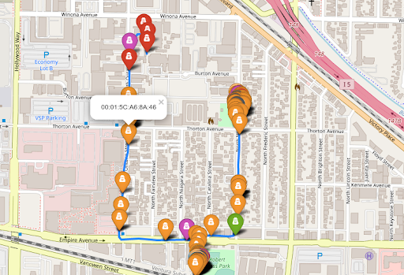

### Introduction
My friend and fellow hacker [Kody Kinzie]() came up with the idea for the **CreepDetector** when we wanted to demonstrate how the average person might find WiFi reconnaissance useful.  Using a technique called **WarDriving**, we wanted to create a proof-of-concept that allows someone to detect potential stalkers - by seeing if a creepy WiFi-enabled device (like a smartphone), is spotted at multiple unique GPS coordinates trailing them.

### What is WarDriving?
WarDriving is a WiFi reconnaissance technique that lets us map the *physical location* of WiFi devices, by driving around with a WiFi & GPS enabled device.  Typically, a hacker might use this to create a map of vulnerable networks & devices, or also  

  
Through apps like [WiGLE](), it's fa
is the act of mapping wireless devices and conducting reconnaissance while moving.  Automated through programs like WiGLE or Kismet, a user can use wardriving software to log information about wireless devices they pass by, like encryption type, MAC address, number of clients, etc on a laptop, or even their phone.  Since we wanted a more powerful setup than a phone, we used a Linux based single board computer running Kismet for our demonstration, although this could easily be replicated on an Android phone with WiGLE.  
### Setup 
Our goal was to create a project that could detect stalkers or devices following you by parsing through the data Kismet outputs, and looking for devices seen more than once at a set threshold distance.  Allowing the user to toggle this threshold, they can plot and map devices spotted using our Jupyter Notebook utility, by simply feeding it their own dataset.

## CreepDetector Featured

<iframe width="560" height="315" src="https://www.youtube.com/embed/wNke7teywOs" title="YouTube video player" frameborder="0" allow="accelerometer; autoplay; clipboard-write; encrypted-media; gyroscope; picture-in-picture" allowfullscreen></iframe>

